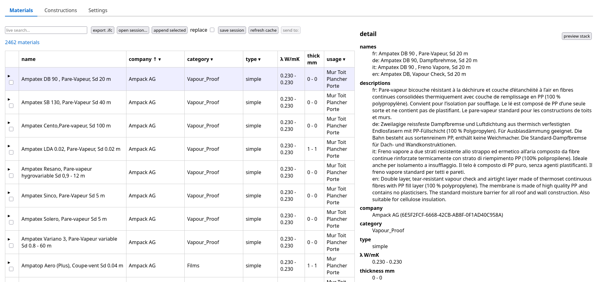
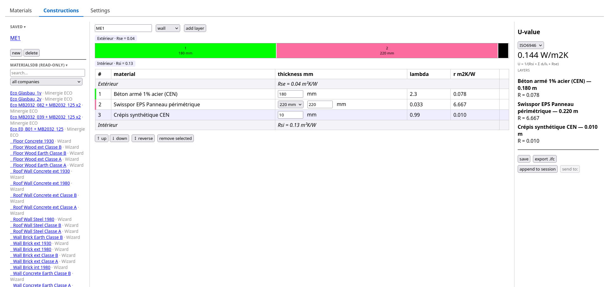
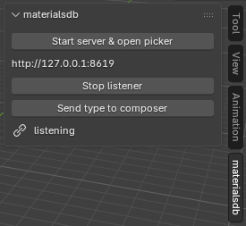

# python-materialsdb 0.2

It has been five years since my [last article on this library](https://pythoncvc.net/?p=909).
Back then it was an alpha: a thin wrapper to convert materialsdb.org data
into an IFC project library. Since then the library grew into a complete
materials workflow: an indexed catalogue, a web GUI to browse and compose
constructions, and a two-way integration with Bonsai (the BlenderBIM
add-on) — shipped as a Blender extension you can install and update like any
other.

# What's new ?

## An indexed catalogue

The library keeps a local sqlite index of everything cached from
materialsdb.org producers (more than 2 000 materials). Filtering by company,
category, λ range, thickness or usage is instant, and parsing got 3.9-4.7x
faster along the way:

```python
from materialsdb import query

query.refresh()                                # update the index from cached xml
rows = query.search("isolant", sort="lambda")  # filtered, sorted summaries
material = query.get_material(rows[0].id)      # full material dataclass
```

## A web application: materialsdb-gui

A dependency-free (stdlib) local web application, started with `materialsdb-gui`.
The picker lets you browse every cached material, sort and facet-filter by
company/category/conductivity, pick whole materials or specific manufacturer
thicknesses, and either export a standalone `.ifc` library or append into the
IFC file open in your session.



## A construction maker

Compose thermal constructions layer by layer, with live U-value computation
(ISO 6946 / SIA 180 surface-resistance presets), a scaled stack preview, saved
constructions in your cache directory, and export as
`IfcMaterialLayerSet`.



## And now: straight into Bonsai

The part I wanted the most. `python-materialsdb` now ships a
**Blender extension**, installable and updatable from inside Blender through
an extension repository:

> *Preferences ▸ Get Extensions ▸ ⌄ ▸ Add Remote Repository* — add
> `https://cyrilwaechter.github.io/python-materialsdb/`, then install
> *materialsdb listener*.

Once installed, the panel in the 3D-view sidebar can start the GUI server for
you, open the picker in your browser, and receive whatever you send:



- **Materials**: pick them in the browser, one click sends them into the
  open IFC model — with their materialsdb identity property set (so Lesosai
  or any materialsdb-aware software can retrieve the full data later),
  per-layer property sets and surface colours. Undoable, of course.
- **Constructions**: the construction maker pushes a construction as an
  `IfcWallType` / `IfcSlabType` / `IfcRoofType` (per its design usage) with
  its `IfcMaterialLayerSet`, visible in the outliner.
- **Round-trip**: select a wall in your model (or its type), send it back to
  the composer, adjust thicknesses — even layers whose material is not a
  materialsdb object are kept as "model material" placeholders — and push it
  back into the *same* layer set. Ctrl+Z rewinds it with a titled undo step.

Everything talks over a small localhost HTTP API, so FreeCAD, Revit or
whatever-you-use listeners can reuse the exact same channel later.

# Installing

```bash
pip install python-materialsdb
```

For the Bonsai integration: add the extension repository URL in Blender, set
your Python interpreter in the add-on preferences (it needs
`pip install python-materialsdb`), and you are set. Detailled instructions in
the [README](https://github.com/CyrilWaechter/python-materialsdb).

# What's next ?

- **Local/project materials file**: promote the "model material" placeholders
  into a project-specific materialsdb file, so foreign materials can live
  across projects and still compute U-values.
- Listeners beyond Bonsai (FreeCAD, Revit) — the protocol is already
  host-agnostic.
- More of the materialsdb data mapped into IFC property sets.

Tagged: Building Energy Modeling (BEM), materials, Bonsai, IfcProjectLibrary, opendata
